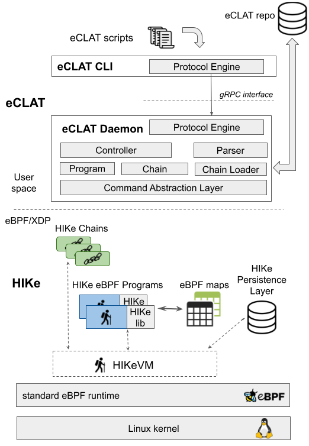

Architecture
============

The architecture is composed of two layers, eCLAT and HIKe. eCLAT offers a simple high level programming abstraction for the "non-expert" developer to compose HIKe eBPF programs. The HIKe layer is needed for the execution of the composed programs and it is used by the "expert" developer to create the HIKe eBPF programs to be used in eCLAT. 

.. https://docs.google.com/drawings/d/1d0Vv5Qungtvin65DelNX1pEuZkuDpRUqJDezE621w8w

eCLAT
----
The "non-expert" user can develop eCLAT scripts composing eBPF programs. The eCLAT layer is based on a user-level daemon, developed in Python, and on a Command Line Interface (also developed in Python) used by the "non-expert" users to interact with the eCLAT Daemon. The interaction between the eCLAT CLI and the Daemon is based on gRPC.

The eCLAT Daemon receives the scripts from the eCLAT Chains described in the eCLAT language. The daemon first "transpiles" them into into C language, generating the source code of HIKe Chains, then it compiles the C HIKe Chains into a bytecode suitable for the HIKe VM. Actually this is not only a compilation operation, because the eCLAT Daemon also works as a linker, resolving the references to HIKe eBPF Programs and to other Chains that are called inside a Chain and writing the HIKe eBPF Program IDs and Chain IDs into the bytecode. Moreover, the eCLAT daemon manages the dynamic compilation, verification and loading of the HIKe eBPF programs that are referred in the Chains. In fact, when a Chain refers to an HIKe eBPF Program, the eCLAT daemon checks if that program is already loaded and if not, it loads it. The compiled/linked bytecode of a Chain is stored by the eCLAT Daemon in the HIKe Persistence Layer, which is based on eBPF maps. The eCLAT Daemon also interacts with eBPF maps in the HIKe layer, that are used by the HIKe eBPF programs to read/write information. 

HIKe
-----
The HIKe layer provides the execution environment for the bytecode of the HIKe Chains. We have designed and implemented a Virtual Machine abstraction called HIKe VM, in the form of an eBPF library that needs to be included in all HIKe eBPF programs. Therefore, to run an eBPF program in the HIKe framework, the source code of the program needs to be slightly modified by adding the calls to the HIKe VM library and the program needs to be recompiled/verified/loaded as any eBPF program.  

